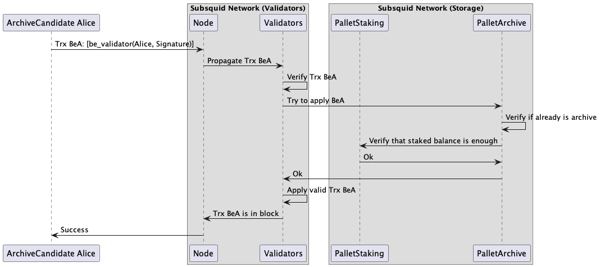
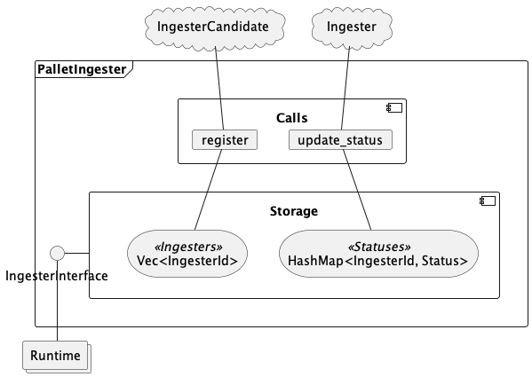
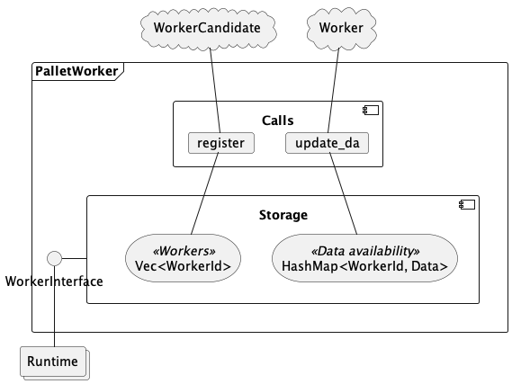
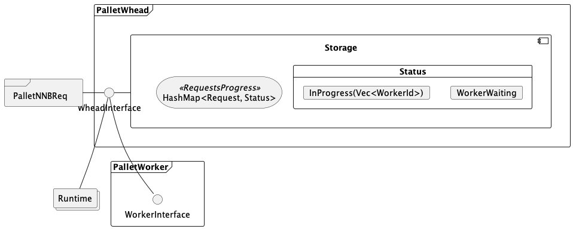
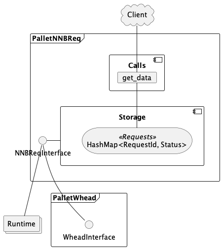
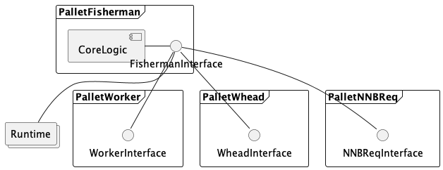

# Archive decentralization v0.1

## Abstract

Current subsquid architecture is organized in a centralized way that has some cons that doesn't provide more useful and interesting features for our users and the project as a business itself. Below is the list of some such features:
- Each archive/squid provides different blockchain data independently.
- You as a user should choose and use an archive/squid based on your own choice.
- You need to implement or ask somebody else for additional tools to verify archive/squid trusted behavior.
- It's difficult to punish somehow archive/squid behaving badly.
- Archive and squid horizontal scalability issue.
- etc.

Today decentralized approaches provide additional good things to make subsquid like projects more trusted with own economic and protocol logic that enables additional ways to bring more advantages in terms of valid requests execution, archive/squids stimulation do their job properly withou behaving badly, horizontal scalability, participating in subsquid at different network layer from a deep technical guy that can run own archive and squid to simple user delegating own tokens to others for future earning rewards.

## Subsquide team goals

- Fast syncs of archives by randomly distributing the blocks between the nodes, encouraging peer-to-peer communication between the nodes.
- Fast syncs of archives for new nodes (by downloading chunks from IPFS rather than from gRPC).
- Distribute the load and the queries between the archives in a leaderless way.
- Incentivize redundancy for ingestion and query resolution, enabling O(1) verification.
- Accomodate frequent updates of the ingesting packages (due to bugs, changes or improvements) and an open-ended set of target blockchains to index.
- Prevent spam requests.
- Validate that an Archive Node is fully in sync and responds with valid data.
- Trustless selection of an Archive Node.
- It should be profitable for archivers to join the marketplace and get rewarded.
- The end client should be able to pay either with KSM/USDT (or any other stable) AND by locking SQD.

## Similar approaches

According to the fact that today we have already running similar projects we think that the best way to come up with a good own design is to analyze these projects with their key features. Below is the list of analyzed projects and links to short summaries.

- [Pocket Network](pokt.md).
- [Graph Protocol](graph.md).
- [KYVE](kyve.md).
- [SubQuery Network](subquery.md).

### Summary

TODO!. It's good to provide our feedback on above projects based on our needs.

## Proposed design

In assumption, that archives business logic is going to manage different stuff like some rules being a part of archives set, regulating and validatation network members activities, economic logic enabling, etc. The general subsquid-network should should consists of 2 key layers, similar to Kyve:
- The chain layer.
- The protocol layer.

### The chain layer

The chain layer is responsible mainly for maintaining decentralized peer-to-peer network that operates the same data storage for the state changes recorded as a result of transactions, consensus methodology for blocks production and finalization to protect against malicious activity and ensure the ongoing progress of the chain, cryptography logic to enable blockchain works in the way we need.

Additionally, as we know, running and maintaining such logic requires resources - processors, memory, storage, and network bandwidth—to perform operations. To support a community and make the network sustainable, users should pay for the network resources they use in different forms that will be defined.

#### Core components

- _Blockchain core state_ that defines transaction execution and application rules.
- _Validators_ are responsible for block production and finalization to maintain state changes properly.
- _Squid token_ to manage economic in terms of token transfer, fees, staking, delegation, etc.

### The protocol layer

The protocol layer is responsible for defining and managing subsquid specific related activities. Logically we should define what is an Archive as a network member, it's goals and rules; who is able to be a part of Archive set; different techniques and mechanisms to process and validate client requests to archives, rewards and punishment logic to stimulate protocol members do their job properly without behaving badly.

### Query client

Any client that sumbits requests to the network related to non-native blockchain requests. The requests is a special transaction kind.

The client should pay a regular network fee to be transaction included into block. As additional parameters the client should specify a cost that will be paid for request. The network verifies that required amount of tokens are already staked to cover the cost.

### Archive

Archive is a service that ingests raw on-chain data, stores it into persistent storage in a normalized way and exposes it via API for downstream data pipelines (such as Squid Processor) and ad-hoc exploration. Compared to data access using a conventional chain node RPC, an archive allows one to access data in a more granular fashion and from multiple blocks at once, thanks to its rich batching and filtering capabilities.

### Archive logical requirements

- Archive is run for particular blockchain network.
- Archive should be run using a predefined docker images.
- Archive should be able to process data extraction requests and return a proper response that will be validated. Requests and responses should meet a predefined format.
- Archive owner should stake a minimum required subsquid tokens to join the Archive set.
- Archive owner should pass a registration process to join the Archive set. It should be possible to pass attestation in case archive is based on the predfined docker images mentioned above.
- Archive should get reward for valid work.
- Archive misbehavior should be punished.

### Become an Archive flow

### Worker (aka Resource Node)

Worker is a part of the network that provides resources for running archives for particular blockchain that are run using dockerized images. In other words, it's a special light client of the network with the following requirements.

#### Requirements

- Worker should pass some registration to be a part of the network.
- Worker should stake required SQD tokens.
- Worker should listen the network for events to run a particular archive in it's environment.
- Worker should use approved (by the network) docker images for running archives.
- Worker should submit a special attestation transaction to verify that an approved image was run for particular blockchain. Otherwise, the worker should be punishment.
- Worker should stop running archive if a special event is produced by the network.
- There is a range of workers number when it's profitable to run it.

### Requests types

We should define a light request in some way. It's like a request that can be processed by one archive using predefined resources and times. The requests that require more resources or time are Heavy requests.

#### Request processing

Requests are submitted to the network on-chain (via transaction). The network devides the request into chunks of light requests if the request is heavy. Then the network should choose a set of archive that should process corresponding light request based on some metrics and prices. The request has a special status until it has been processing.

When the archive is ready to provide response to submmitted light request then it submits the response via a transaction as well. The response can contain some proof of processed data that link to any distributed storage like IPFS.

_Note_: We can consider submitting proof of few responses instead of submitting one on-chain transaction for each response separately. Just collect request and response into some proof and later submit it included into proof transaction.

The network validate responses and does punishment logic if it's required.

TODO!. A scheme to illustrate request processing flow.

### Pools

Archive with the same target blockchain can be united into Pools. The Pool is able to process more than 1 light requests as it consists of some number of archives. The Pool should define their resources, times, prices, number of light requests that can be proccesed in 1 unit request time. It's required to properly choose a set of archives and pool that will process incoming request by the network.

The pool owner defines the pool rewards, the canonical image for the archive.

### Aka Fisherman service

It's a network member that run a service that meets requirements to validate archive and pool responses and in the event of an invalid response, may run a protocol-level dispute.

### Staking

To ensure that archives process requests honestly, the archives have to stake subsquid tokens. In case of misbehaving (e.g., uploading and submitting invalid data), the archive or pool would get slashed.

### Delegating

Delegation is a form of staking which does not require you to run your node or archive. Uou can delegate to both validators and archives, allowing you to have multiple ways of earning rewards for your tokens.

## Implementation key thoughts

Before going in depth about the archive decentralized implementation itself we would like to consider basic approaches of decentralization logic implementation. There are the following keys options to enable it:

- _Develop on top of existing blockchain_. Building on top of an existing blockchain comes with many advantages. As an extant blockchain would already be fully functional, the only bits to worry about would be implementing our custom logic. However, the most meaningful limit for us is scaling. In this case, the chain layer should operate considered blockchain with it's rules. It doesn't allow to customize token economics as it always should rely on existing native economic as well.
- _Write own blockchain from scratch_. This approach allows maximum flexibility in how to use blockchain. But it's extremely expensive that requires to spend a lot of time to security related tasks that are not a part of our main focus. Additionally, there are hard problems around scale, governance, interoperability, and upgradeability to address.
- _Use a blockchain framework_. A blockchain framework is a kind blockchain that already provides key blockchains componenents that easly can be customized based on you needs. These offerings with peering, consensus, blockchain storage, and other important systems built–in, while allowing you to plug in your own custom transactions, verification rules, and state. There are some of them like Hyperledfer family frameworks, R3 Corda, Substrate, etc.

Based on it we decided that using a blockchain framework suits us the best based on our subsquid goals as we don't aim to overcame obstacles in terms of general blockchain tasks.

After speding some time on blockchain framework research, we decided to use a Substrate as it provides the following great features: [flexible](https://docs.substrate.io/fundamentals/why-substrate/#flexible), [open](https://docs.substrate.io/fundamentals/why-substrate/#open), [interoperable](https://docs.substrate.io/fundamentals/why-substrate/#interoperable) and [future-proof](https://docs.substrate.io/fundamentals/why-substrate/#future-proof).

## PoC vision to verify the logic of decentralized archives.

### Introduction

We would like to verify general vision and flow of data requests and processing based on the following key components:

- _Client_ that submits requests to the network to get required data from non native blockchain networks.
- _Validator_ (chain layer node) that mantains general blockchain logic and state.
- _IPFS_ to store processed non native blockchain networks data by archives.
- _Archive (Ingester)_ that communicates with a particular non native blockchain network and stores processed data into _IPFS_.
- _Worker_ listens the subsquid network events and executes a stream of tasks sourced from the network on a machine it is running on.

### The general scheme

The below you can see a high-level scheme that describes communication and data processing between key components.

### Implementation details

#### Client

A simple software that is able to submit different non native blockchain requests with possible filters to subsquid network.

#### Ingester

For PoC purposes we are going to use centralized ingester that process non native blockchain network data and stores processed data into IPFS in parquet file format.

Ingester periodically (for example, each 100k blocks) submits a special extrinsic to the network to announce it's state.

Should be registered in the network.

#### Worker

Compute worker providers install on their machines a special daemon called Worker client. Worker client sequentially executes a stream of tasks sourced from blockchain network on a machine it is running on.

- submits data availability extrinsics to the network to update network runtime state respectively.
- listens events from ingester (submitted extrinsic with entire current state) to download non native blockchain processed data from IPFS if it's required.
- listens network events to run a particular job to process client request (partial or full).
- store job's result to IPFS.
- submits job's result to the network in form of extrinsic.

#### Subsquid substrate-based network

Implements additional core logic to simple basic blockchain implementation:

- `pallet-ingester`: manage the list of ingesters with their up-to-date internal state.

- `pallet-worker`: manage the lists of workers with their up-to-date internal state that are registered in the network, provides a respective interface to the list and state to manage it.

- `pallet-whead`: manage the rules by which a specific subset of workers is going to process client requests, expose an interface as well.

- `pallet-nnbreq`: process clients non native blockchain requests.

- `pallet-fisherman`: verify workers jobs results and apply punishment rules if it's required.

